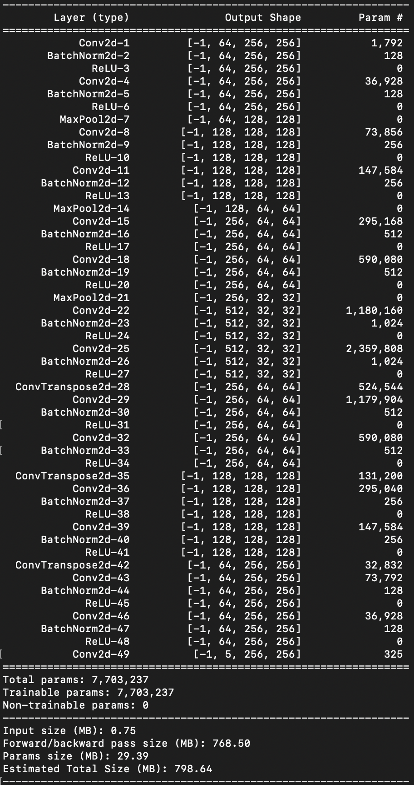
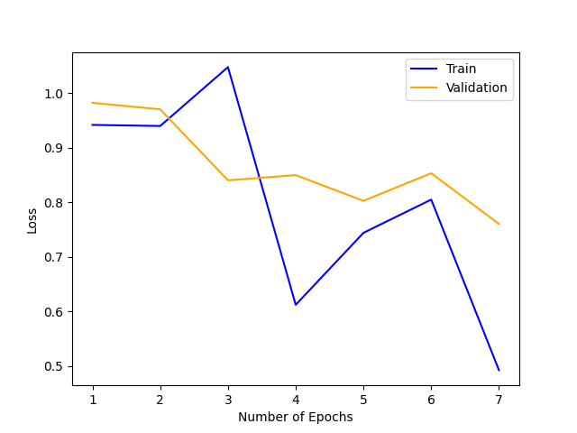
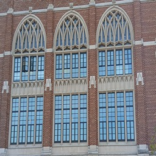
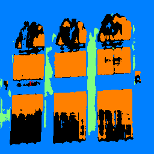

# Semantic-Segmentation

## 1. Model Architecture
**U-Net Architecture** with encoder-decoder structure and skip connections:

### Encoder (Downsampling Path)
- **Block 1** (64 channels):
  - Conv3x3-BN-ReLU ×2 → MaxPool2x2
- **Block 2** (128 channels):
  - Conv3x3-BN-ReLU ×2 → MaxPool2x2
- **Block 3** (256 channels):
  - Conv3x3-BN-ReLU ×2 → MaxPool2x2

### Bottleneck (512 channels)
- Conv3x3-BN-ReLU ×2

### Decoder (Upsampling Path)
- **Block 1** (256 channels):
  - ConvTranspose2x2 → concat(encoder3) → Conv3x3-BN-ReLU ×2
- **Block 2** (128 channels):
  - ConvTranspose2x2 → concat(encoder2) → Conv3x3-BN-ReLU ×2
- **Block 3** (64 channels):
  - ConvTranspose2x2 → concat(encoder1) → Conv3x3-BN-ReLU ×2

**Final Layer**: Conv1x1 → 5 output channels

{:height="300px"}

## 2. Training Configuration
```python
# Hyperparameters
optimizer = Adam(lr=1e-4, weight_decay=1e-5)
criterion = CrossEntropyLoss(weight=[1.0, 1.0, 5.0, 1.0, 1.0])
epochs = 7
batch_size = 1  # Due to GPU memory constraints
```

## 3. Performance Metrics
| Class     | AP    |
|-----------|-------|
| Others    | 0.59  |
| Facade    | 0.72  |
| Pillar    | 0.26  |
| Window    | 0.87  |
| Balcony   | 0.71  |
**Mean AP**: 0.63

## 4. Usage Instructions

### Dependencies
```bash
pip install torch torchvision numpy matplotlib opencv-python scikit-learn pypng colormap
```

### Training
```bash
python train.py
# Model saves to: models/model_starter_net.pth
# Predictions save to: output_test/
```



### Inference on Custom Image
1. Add your image as `input.jpg`
2. Add this code to `train.py`:
```python
# After model loading
img = cv2.imread("input.jpg")
img = transforms.ToTensor()(img).unsqueeze(0).to(device)
output = net(img).argmax(dim=1).cpu().numpy()[0]
save_label(output, "output.png")
```

## 5. Example Results
**Input** (`input.jpg`)          | **Output** (`output.png`)
:-------------------------:|:-------------------------:
  | 

**Observations**:
- Correctly segments large windows (orange) and balcony rails (red)
- Struggles with thin vertical pillars (green)
- Confuses dark facade areas with "others" class